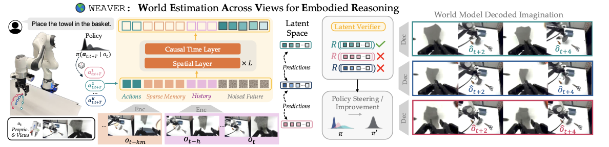

# WEAVER, Better, Faster, Longer: An Effective World Model for Robotic Manipulation


<p class="authors">
  <a href="https://arnavkj1995.github.io/">Arnav Kumar Jain</a><sup>1,2,*</sup>,
  <a href="https://yilin-wu98.github.io/">Yilin Wu</a><sup>3,*</sup>,
  <a href="https://borsa.ca/">Jesse Farebrother</a><sup>1,4</sup>,
  <a href="https://gokul.dev/">Gokul Swamy</a><sup>3</sup>,
  <a href="https://www.cs.cmu.edu/~abajcsy/">Andrea Bajcsy</a><sup>3</sup>
</p>

<!-- TODO: add paper, arXiv, project website, pretrained checkpoints, and dataset links when public. -->

[](LICENSE)
[](https://www.python.org/)
[](https://pytorch.org/)
[](https://arnavkj1995.github.io/WEAVER/)
[](https://huggingface.co/arnavkj1995/WEAVER)

---

We introduce WEAVER: a world model architecture that satisfies the three desiderata: (i) fidelity, (ii) consistency, and (iii) efficiency. WEAVER unlocks state-of-the-art performance across policy evaluation (ρ = 0.870 correlation with real-world success rate), policy improvement (real-world success rate improvement of 38% on top of the π0.5 robot foundation model), and test-time planning (real-world success rate improvement of 14% with a 5–10× speedup over prior WMs).



## 🛠️ Setup

Create a Python 3.11 environment and install dependencies with `uv`.

```bash
git clone <repo-url> WEAVER
cd WEAVER
uv venv --python 3.11
source .venv/bin/activate
uv sync
```

For optional logging and development dependencies:

```bash
uv sync --extra logging --extra dev
```

You can also run commands directly through `uv`:

```bash
uv run python -m weaver.generate_views --help
```

## Model Checkpoints and Datasets

Download all released checkpoints from [HuggingFace](https://huggingface.co/arnavkj1995/WEAVER):

```bash
hf download arnavkj1995/WEAVER \
  --local-dir checkpoints
```

This downloads the `WEAVER`, `WEAVER-FT`, and `WEAVER-ReFlow` folders. Each
folder contains `checkpoint.pt`, `config.yaml`, and `norm_stats_relabel.json`.

## 📁 Repository Structure

This repository implements the main WEAVER components: the latent flow world model, DROID dataloaders, reward and critic heads, rollout generation, and offline evaluation utilities.

```text
WEAVER
├── assets                           # README and release assets
├── datasets                         # DROID preprocessing and SD3 latent encoding utilities
├── scripts                          # Slurm launchers and offline evaluation scripts
├── weaver                           # Core WEAVER package and training/generation entrypoints
│   ├── datasets                     # Runtime DROID-style dataloaders
│   ├── utils                        # Config, checkpointing, evaluation, and metric utilities
│   └── wm                           # Latent flow world model, encoders, decoders, and transformer blocks
├── pyproject.toml                   # Package metadata and dependencies
└── README.md
```

## 💾 Datasets

WEAVER expects preprocessed DROID-style trajectories with actions, states, language features, rewards, normalization statistics, and either view videos or precomputed SD3 latents.

Preprocess a raw DROID download into the format expected by WEAVER:

```bash
python datasets/preprocess_droid.py \
  --data_root /path/to/raw_droid \
  --output_root /path/to/preprocessed_droid
```

See the [dataset preprocessing guide](datasets/README.md) for the expected
folder structure, parallel preprocessing, and normalization statistics.

## 🚀 Training WEAVER

By default, normalization statistics are loaded from
`<dataset.path>/norm_stats_relabel.json`. Released checkpoints should bundle
this file and set `dataset.norm_stats_path=/path/to/model/norm_stats_relabel.json`
when training or running inference.

Pretrain from scratch:

```bash
DATASET_PATH=/path/to/preprocessed_droid \
SCRATCH_DIR=/path/to/output/model_dir \
sbatch scripts/pretrain.sh
```

Finetune from a checkpoint:

```bash
PRETRAINED_DIR=/path/to/pretrained/logs/chkpts \
DATASET_PATH=/path/to/finetune_data \
EXP_NAME=weaver_finetune \
FINETUNE_SUFFIX=finetune \
sbatch scripts/finetune.sh
```

Run ReFlow post-training to distill a multi-step teacher into a faster student rollout:

```bash
PRETRAINED_DIR=/path/to/teacher/logs/chkpts \
PRETRAINED_CKPT_NAME=checkpoint.pt \
DATASET_PATH=/path/to/preprocessed_droid \
EXP_NAME=weaver_reflow \
FINETUNE_SUFFIX=reflow \
sbatch scripts/reflow.sh
```

All training launchers use four H100 GPUs with distributed data parallelism.

## 🔮 Inference

### Basic Inference

Generate rollout views and videos:

```bash
python -m weaver.generate_views \
  --checkpoint /path/to/logs/chkpts \
  --output-dir /path/to/eval_output \
  --split val \
  --use-real-history \
  --overrides \
    dataset.path=/path/to/eval_dataset \
    model.val_steps=27 \
    eval_horizon=5 \
    eval_bootstrap=5 \
    inference.pyramid_stagger_width=1 \
    inference.pyramid_schedule=cosine
```

### ⏱️ Inference Schedules

The main inference controls are:

- `model.val_steps`: number of flow denoising steps.
- `eval_horizon`: number of future frames generated per chunk.
- `eval_bootstrap`: number of generated frames fed back before the next chunk.
- `inference.pyramid_schedule`: denoising schedule used during rollout (`linear`, `cosine`, `power`, `sigmoid`).
- `inference.pyramid_stagger_width`: offset between frame-wise denoising schedules.

For staggered inference, the effective number of function evaluations is:

```text
NFE = val_steps + eval_horizon * pyramid_stagger_width
```

Typical settings:

```bash
# Lockstep, all future frames share the same noise level.
model.val_steps=8 eval_horizon=5 inference.pyramid_stagger_width=0

# Staggered pyramid rollout.
model.val_steps=45 eval_horizon=5 inference.pyramid_stagger_width=1
```

Slurm launchers for generation workflows are available in [`scripts/`](./scripts/).

## 📊 World Model Evaluation

Compute FID, FVD, and LPIPS from an evaluation output folder:

```bash
EVAL_DIR=/path/to/eval_output \
sbatch scripts/compute_eval_metrics.sh
```

The folder may be the evaluation root or its `views/` subdirectory. It must
contain the saved `gt_*.npy` and `pred_*.npy` camera views.

---

## 📚 Citation

If you use WEAVER, please cite the corresponding paper once available.

```bibtex
@article{weaver2026,
  title={WEAVER: Efficient World Models for Robot Video Prediction},
  author={TBD},
  year={2026}
}
```

---

## 🙏 Acknowledgements

WEAVER is developed from the open-source video foundation model [Stable Video Diffusion](https://github.com/Stability-AI/generative-models) and multi-view world model [Ctrl-World](https://ctrl-world.github.io/). The VLA model used in this repository is from [openpi](https://github.com/Physical-Intelligence/openpi).
